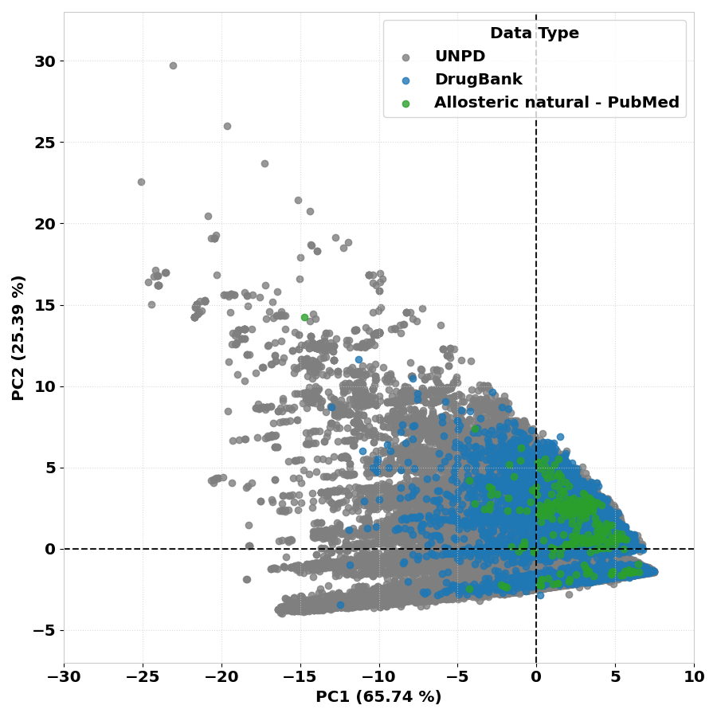
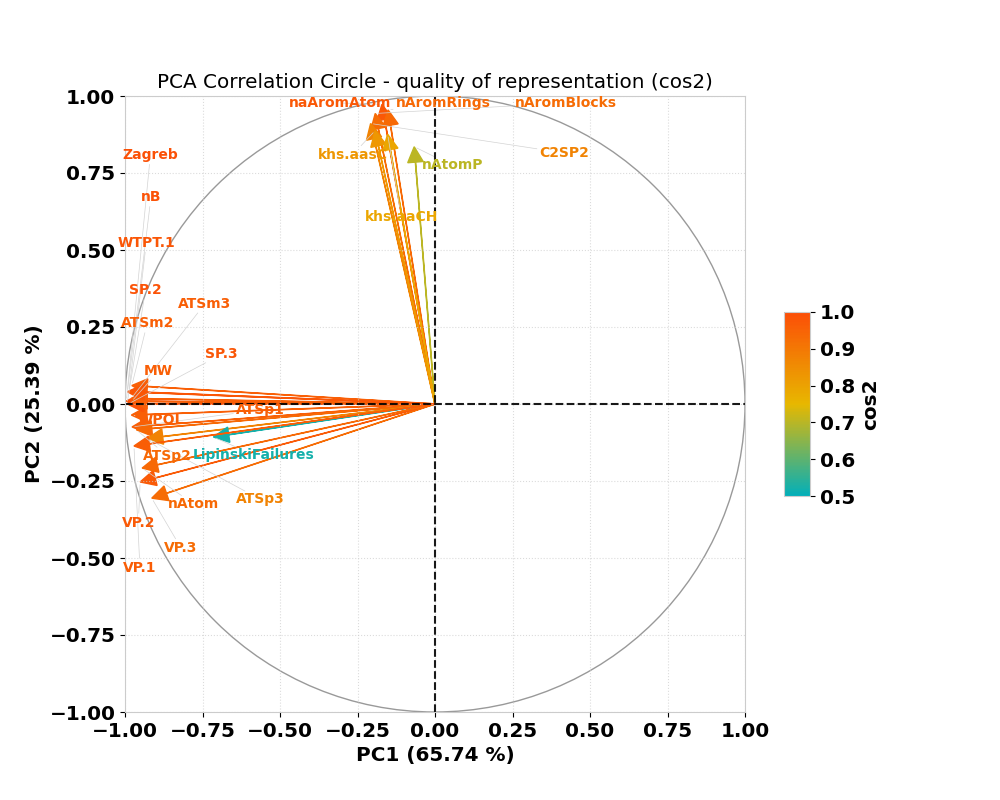
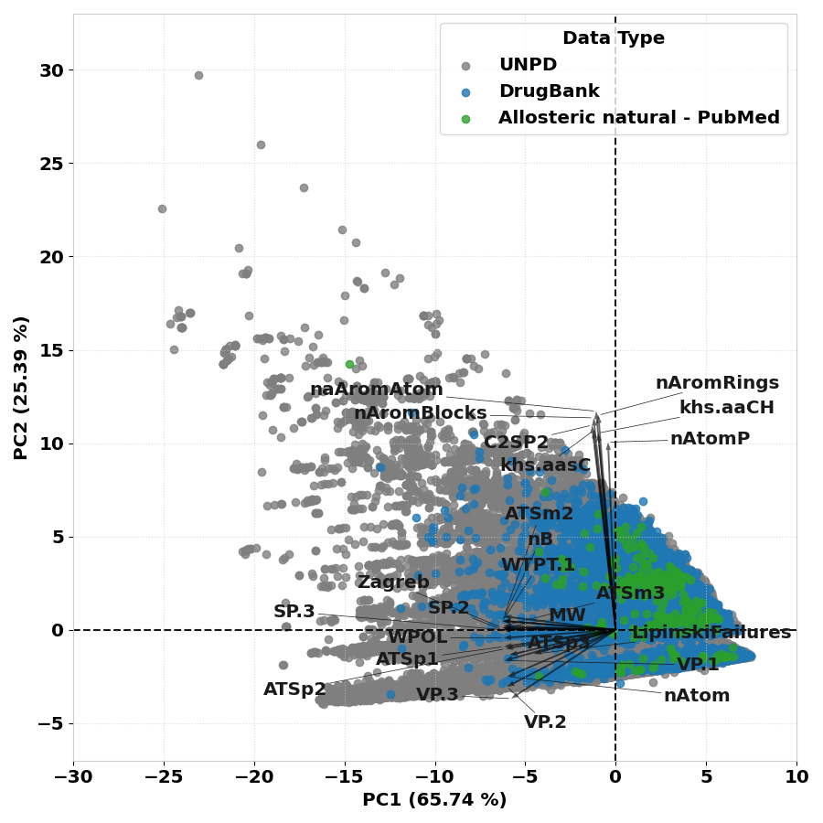

## Details

At the end of the pipeline processing, the NP³ MS Workflow **run**, **join_jobs** and **clean** commands will automatically create different
final reports with statistics of the final results. These reports are stored in a
folder named 'final_reports', located in the final output folder inside outs/*output_name*/.

The NP³ MS Workflow final reports are organized in three different groups: *quantification*, *chemical* and *molecular networking* statistics, separated in different subfolders.

#### **Quantification** Report

The quantification report is located inside the *quantification_report* subfolder and contains:

- A table with the final quantification of clean consensus spectra, with statistics of the total number of m/z in blank and bed samples, global spectral identification rate against UNPD-tremolo, average number of putative isomers, number of isotope ions and number of fragmented clusters.

#### **Chemical** Report

The chemical report is located inside the *chemical_report* subfolder and contains: 

- A table with statistics of the final putative [M+H]+ ions, their redundancy over the samples and spectral identification and putative novelty against the UNPD-tremolo after and before the curation. If the GNPS2 library search is enable or when gnps_result is executed, a similar table is created with the spectral identification and putative novelty against the GNPS libraries. Additionally, another table is created with the final identification curation statistics from GNPSxUNPD top quality library annotations and the statistics of the complete identifications before curation are also included for an ease comparison.
- A folder named *chemical_space_identifications* with the chemical space plot of the identifications using PCA based on the CDK [26] descriptors calculated for the identified SMILES. These are created and compared against reference datasets (more details below).
- Another folder named *chemical_space_mzs* with the chemical space plot of the m/z, retention time and their quantification information.
- A plot with the distribution of the superclass grouping among the not blank and not bed samples. This plot is computed using the percentage of occurrence of each superclass in the final library annotated m/z.

The identification curation is detailed in section 4.6.4 for UNPD, in 4.12.4 for GNPS and in 4.6.5 for the final identification curation.

#### Molecular Networking report
The molecular networking report is located inside the *molecular_networking_report* subfolder and contains:

- One table for each network created by the NP³ pipeline containing some network statistics such as size, average degree, number of isolates, number of components by size and clustering coefficients.

All statistics present in the created tables have a column with a detailed description explaining how they are calculated and what they represent. These values synthesize the final NP³ results and accelerates further analysis.

#### NP³ Chemical Space

The NP³ chemical space of the identifications created in the chemical report was standardized to use *PCA* and to be created using the unique compounds (SMILES) of three reference datasets: 

- The complete UNPD from 2018: 169383 compounds;
- The natural drugs from DrugBank 2019: 8757 compounds;
- And the natural allosteric drugs from a 2019 review[^1]: 335 compound. 

These reference datasets will always be the background of the created PCA chemical space and 
have a total of 178345 unique compounds, as shown below.

The [CDK descriptors](https://cdk.github.io/)[^2] of these reference data was computed for each final SMILES and 
the top 24 descriptors were selected based on their variance explanation of the final PCA and importance for 
Drug Discovery (LipinskiFailures, MW and nAtom were fixed). Their circle plot with the quality of their representation is shown below.

The top 24 descriptors selected from CDK contains 18 topological and 6 constitutional descriptors and are named: 

- 'WPOL','ATSp1','ATSp2','SP.3','Zagreb','VP.3','naAromAtom','SP.2','ATSp3','VP.2','ATSm3','nB',
'ATSm2','nAromRings','nAromBlocks','C2SP2','khs.aasC','nAtomP','khs.aaCH','LipinskiFailures','MW',
'nAtom','VP.1','WTPT.1. 
- Their descriptions can be found in the [CDK site](https://cdk.github.io/) or the supplementary information of their review[^2]. 
The reference dataset used to create the PCA chemical space is deposited in the repository folder at:

- '[NP3_MS_Workflow/src/final_report/Chemical_space_data/descriptors_reference_table.zip](https://github.com/danielatrivella/NP3_MS_Workflow/blob/master/src/final_report/Chemical_space_data/descriptors_reference_table.zip)'. 

The reference dataset contains all the SMILES from the three sources with their top 24 CDK descriptors calculated using R. Their PCA plot with the descriptions components is shown below.

##### PCA Chemical Space Creation

For each final NP³ result, in the chemical report creation, the clean consensus spectra identified against UNPD and 
curated are used to create the PCA, blanks and beds are removed (BLANKS_TOTAL == 0 and BEDS_TOTAL == 0 are used). 
The final best curated SMILES are selected (column tremolo_SMILES_best with tremolo_UNPD_score_best > 0) and their 
top CDK descriptors are extracted. These new data is then transformed into the reference PCA and plotted. 
The PCA for only protonated m/zs is also created following the same procedure (the name of its final plot will contain 
the 'protonated' tag).

The format of the final chemical space and the circle plot with the top 24 components can be found at 
[NP3_MS_Workflow/docs/chemical_space_reference](https://github.com/danielatrivella/NP3_MS_Workflow/blob/master/docs/chemical_space_reference/). The PCA method was chosen to create the chemical space of the NP³ results 
because it allows keeping a high understanding of the result with the principal components showing the respective variables information. 
A better understanding is more important here than a better clustering of the identifications.

A PCA plot is also created in the **gnps_result** and **gnps_library_search** commands using the curated identifications 
joined from GNPS (see details of this result in Section 4.12.4).

##### PCA Chemical Space of m/z
Another PCA is created in the chemical space plot of the final m/zs, which uses the final clean consensus spectra 
chromatographic information (m/z, rtMean, sumInt, maxArea, basePeakInt) to create a PCA for viewing their scattering. 
For now no coloring or grouping is being applied in this PCA, this is a *beta analysis* to be improved.

##### PCA command

Furthermore, the command **pca_plot** may be used to create other PCA plots, a posteriori or with external data, 
using the NP³ reference chemical space as base (exploratory analysis). See details in this command Section 4.14.
 

## References

[^1]: Marjorie Bruder, Gina Polo, Daniela B.B. Trivella, Natural allosteric modulators and their biological targets: molecular signatures and mechanisms. See DOI: https://doi.org/10.1039/c9np00064j, Natural Product Reports, Volume 37, Issue 4, 2020, Pages 488-514, ISSN 0265-0568. (Allosteric Review)
[^2]: F. Huber, S. Verhoeven, C. Meijer, H. Spreeuw, E. M. Villanueva Castilla, C. Geng, J.J.J. van der Hooft, S. Rogers, A. Belloum, F. Diblen, J.H. Spaaks, (2020). matchms - processing and similarity evaluation of mass spectrometry data. Journal of Open Source Software, 5(52), 2411, https://doi.org/10.21105/joss.02411 (matchms)
26. Steinbeck et al. Recent Developments of the Chemistry Development Kit (CDK) - An Open-Source Java Library for Chemo- and Bioinformatics. Curr. Pharm. Des. 2006; 12(17):2111-2120, doi:10.2174/138161206777585274 (free green Open Acccess version) (CDK descriptors for PCA).