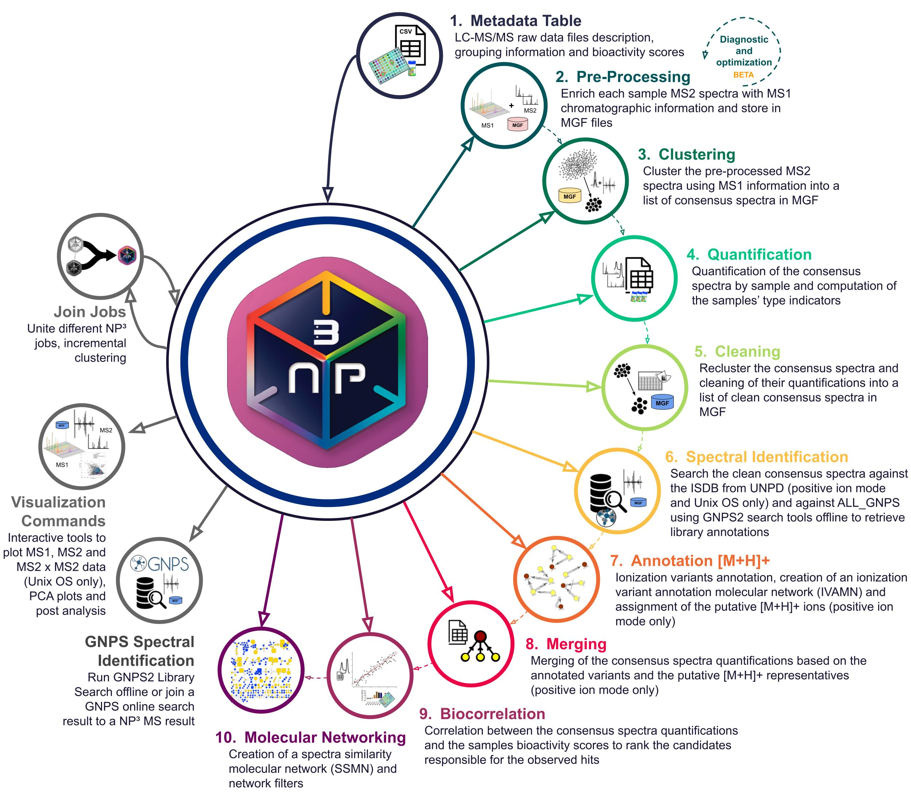

# NP³ MS Workflow: A Pipeline for LC-MS/MS Metabolomics Data Process and Analysis  

**Current Version 1.6.0**

## Pipeline Description

The NP³ MS workflow[^1] is a tool to process and analyse LC-MS/MS data from targeted and untargeted metabolomics 
research with a single click! 

The algorithms approach are focused on drug discovery (untargeted) with optimization towards natural products (NP). 
It ensures high sensitivity for minority compounds while distinguishing them from noise.

The workflow pipeline is an automatized procedure to cluster and quantify all the MS2 spectra (MS/MS) associated 
with the same ion, which eluted in concurrent chromatographic peaks (MS1), separating isomers, of a collection of samples 
from LC-MS/MS experiments. It generates a rank of candidate spectra responsible for the observed hits in bioactivity 
experiments, suggests the number of metabolites present in the samples ([M+H]+ ions) and 
constructs molecular networks to improve the analysis and visualization of the results.

The NP³ MS Workflow consists of ten major steps exemplified in the following image and described below:

* *Step 1*: Metadata table construction describing the input LC-MS/MS samples, bioactivity scores and groups. This is the only step that requires user intervention.
* *Step 2*: Raw data pre-process, that enriches the MS2 spectra with MS1 chromatographic peak dimensions.
* *Step 3*: Clustering of pre-processed MS2 spectra into a collection of consensus spectra.
* *Step 4*: Quantification of consensus spectra per sample and computation of the sample type indicators.
* *Step 5*: Pairwise similarity comparisons of consensus spectra and cleaning of their quantifications based on the similarity values into a set of clean consensus spectra.
* *Step 6*: Library spectra identification of consensus spectra against In-Silico predicted MS/MS spectrum of Natural Products Database (ISDB) from the Universal Natural Products Database (UNPD) using the tremolo tool (for Unix OS and positive ion mode only). And GNPS2 library search (6.1) against community LC experimental data.
* *Step 7*: Ionization variants annotation among concurrent clean consensus spectra (adducts, neutral losses, multiple charge, dimers/trimers, isotopes and in-source fragmentation are considered), creation of a ionization variant annotation molecular network (IVAMN) and assignment of the most likely [M+H]+ consensus spectra representatives (for positive ion mode only).
* *Step 8*: Merge of clean consensus spectra quantifications based on the annotated variants and the [M+H]+ representatives (for positive ion mode only).
* *Step 9*: Correlation between the consensus spectra quantifications and the samples bioactivity scores to rank the candidates responsible for the observed hits in bioactivity experiments. It also computes the quantification grouping.
* *Step 10*: Creation of a spectra similarity molecular network (SSMN) based on the clean consensus spectra similarity and creation of the protonated networks IVAMN [M+H]+ and SSMN [M+H]+ filtered.

## References
[^1]: C.F. Bazzano, et al. (2024). *NP³ MS Workflow*. Analytical Chemistry 96 DOI: 10.1021/acs.analchem.3c05829